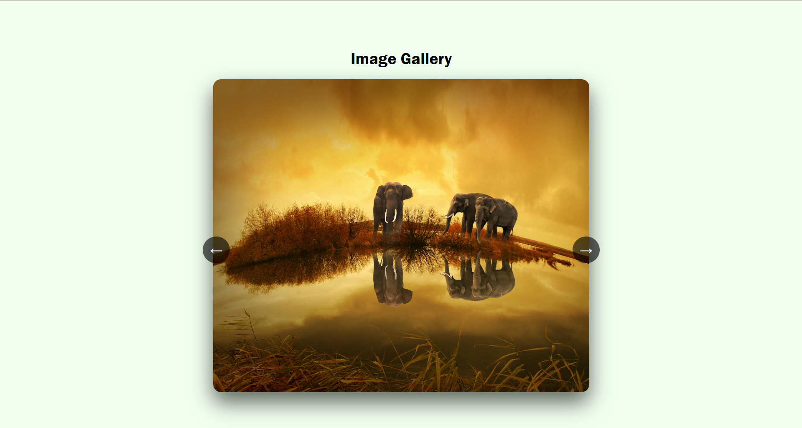
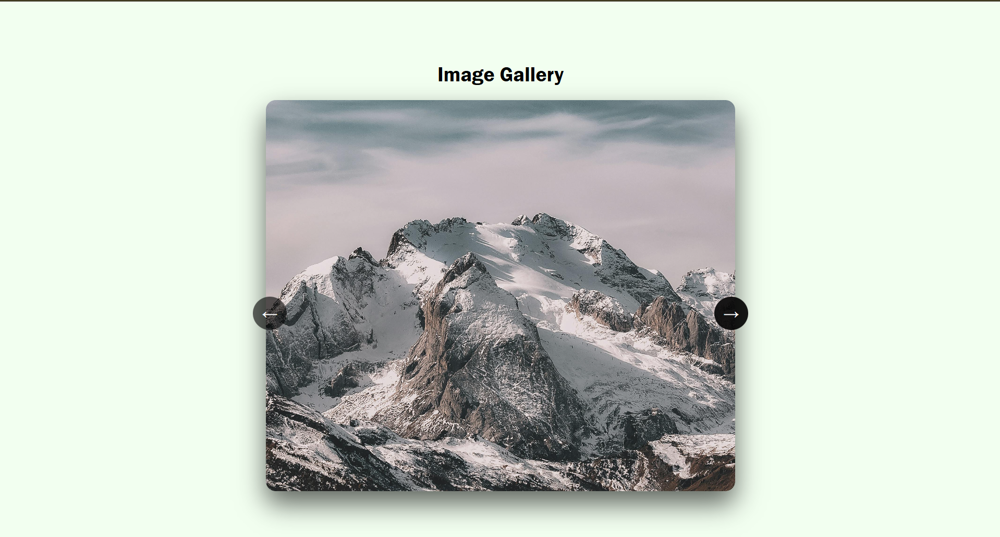
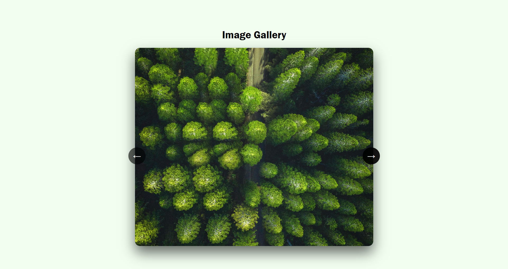

# Ex.07 Design of Interactive Image Gallery

## AIM
  To design a web application for an inteactive image gallery with minimum five images.

## DESIGN STEPS

## Step 1:

Clone the github repository and create Django admin interface

## Step 2:

Change settings.py file to allow request from all hosts.

## Step 3:

Use CSS for positioning and styling.

## Step 4:

Write JavaScript program for implementing interactivit

## Step 5:

Validate the HTML and CSS code

## Step 6:

Publish the website in the given URL.

## PROGRAM
### index.html
```html
<!doctype html>
<html>
  <head>
    <link rel="stylesheet" href="style.css" />
  </head>
  <body>
    <section>
      <h1>Image Gallery</h1>
      <div class="slider">
        <button class="prev" onclick="change(-1)">&larr;</button>
        
        <button class="next" onclick="change(1)">&rarr;</button>
      </div>
    </section>

    <script>
      const images = ["01.jpg", "02.jpg", "03.jpg", "04.jpg", "05.jpg"];
      let index = 0;

      function change(step) {
        index = (index + step + images.length) % images.length;
        document.getElementById("display").src = images[index];
      }
    </script>
  </body>
</html>
```

### style.css
```css
body {
  margin: 0;
  height: 100vh;
  display: flex;
  justify-content: center;
  align-items: center;
  background: rgb(242, 255, 240);
  font-family: 'Franklin Gothic Medium', 'Arial Narrow', Arial, sans-serif;
}

section {
  align-items: center;
  justify-content: center;
  display: flex;
  flex-direction: column;
}

.slider {
  position: relative;
  width: 800px;
  max-width: 90%;
}

.slider img {
  width: 100%;
  height: 600px;
  object-fit: cover;
  border-radius: 15px;
  box-shadow: 0 20px 40px rgba(0, 0, 0, 0.6);
}

.slider button {
  position: absolute;
  top: 50%;
  background: rgba(0, 0, 0, 0.6);
  color: white;
  border: none;
  font-size: 24px;
  padding: 12px 14px;
  cursor: pointer;
  border-radius: 50%;
}

.prev {
  left: -20px;
}

.next {
  right: -20px;
}

.slider button:hover {
  background: rgba(0, 0, 0, 0.9);
}

```

## OUTPUT






## RESULT
  The program for designing an interactive image gallery using HTML, CSS and JavaScript is executed successfully.


Name : ASWIN B \
Register Number : 212224110007